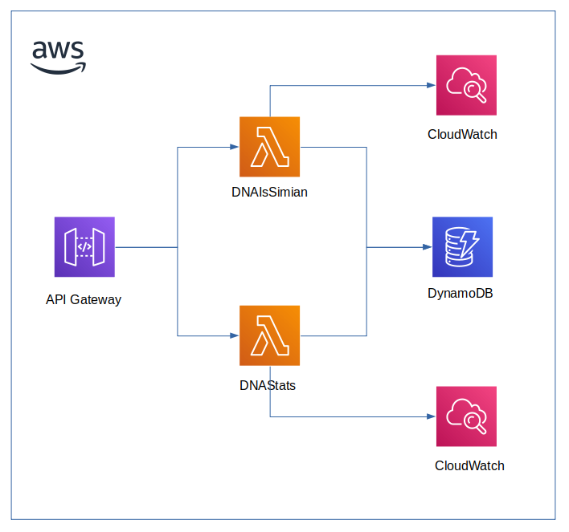

# Teste Símios - Mercado Livre

O teste proposto foi resolvido usando a liguangem Go e o provedor de nuvem Amazon AWS.

## Arquitetura
A solução tem como base uma arquitetura Serverless (AWS Lambda) e está implementada conforme mostrado na figura seguinte:



## Testes unitários e de corbetura

Os testes unitáros e de cobertura de código podem ser realizados por meio do seguinte comando:

```bash
$ go test ./... -v -short -cover
```

O comando deve ser executado no diretório `src`.

## Testes API

A API pode ser testada por meio do seguintes comandos:

- Endpoint `simian`

```bash
# Esperasse que o resultado seja um HTTP 200 - OK
$ curl -d '{"dna": ["CTGATA", "CTATGC", "CATTGT", "CCAGGG", "CCCATA", "TCACTG"]}' https://9n01fkyuc3.execute-api.us-east-1.amazonaws.com/staging/simian
```

```bash
# Esperasse que o resultado seja um HTTP 403 - Forbidden
$ curl -i -d '{"dna": ["ATGCGA", "CAGTGC", "TTATTT", "AGACGG", "GCGTCA", "TCACTG"]}' https://9n01fkyuc3.execute-api.us-east-1.amazonaws.com/staging/simian
```

```bash
# Esperasse que o resultado seja um HTTP 400 - Bad Request
$ curl -i -d '{"dna": ["CTGATA", "CTATGC", "CATTGT", "CCAGGG", "CCCATA", "TCACTK"]}' https://9n01fkyuc3.execute-api.us-east-1.amazonaws.com/staging/simian
```

- Endpoint `stats`

```bash

$ curl -i https://9n01fkyuc3.execute-api.us-east-1.amazonaws.com/staging/stats
```